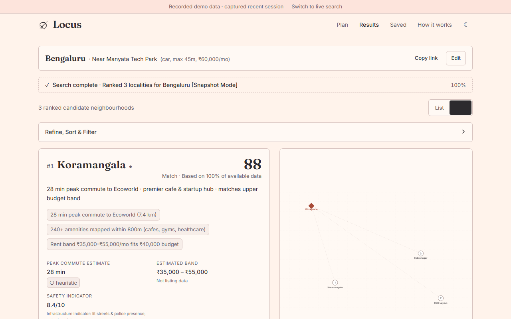
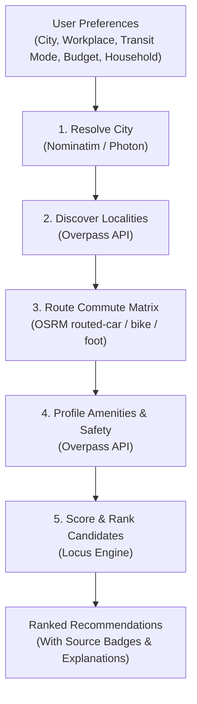

# Locus

Find where to live in India, with every number showing its source.

[Live Search (Render)](https://locus-cfyg.onrender.com) · [Instant Demo (Vercel)](https://locus-ashy-eight.vercel.app) · <!-- HUMAN: Demo video link (e.g. [Demo Video](https://...)) -->



### 60-Second Tour

1. Open the [Instant Demo](https://locus-ashy-eight.vercel.app) to explore pre-recorded sessions (Delhi, Bengaluru, Pune) with zero network cold-start.
2. Search Delhi to see candidate neighbourhoods discovered dynamically from OpenStreetMap boundaries.
3. Open an area card (such as Malka Ganj or Koramangala) to inspect the transparent score breakdown, points allocation, raw physical counts, and provenance labels (`[osm]`, `[heuristic]`, `[tier band]`).
4. Try a live search for any Indian city on the [Render deployment](https://locus-cfyg.onrender.com) to watch the live pipeline query public endpoints directly.

---

## What It Does

- Discovers candidate neighbourhoods dynamically from OpenStreetMap administrative and place hierarchies across any Indian city, with zero hardcoded locality databases.
- Estimates commute durations across driving, cycling, and walking via OSRM road graph tables, applying a published congestion model for peak hours.
- Profiles physical everyday amenities (groceries, healthcare, transit, schools, cafes) within pedestrian radii (500 m, 800 m, 1,500 m).
- Ranks localities against user budget, commute ceiling, transit mode, and household personas using transparent utility scoring, explaining every score in plain English.
- Preserves truth over false precision: missing data is displayed as `null` with a clear explanation rather than masked behind invented defaults.

### Honest by Design

| Metric Category | Source / Method | Classification | Provenance Badge |
| :--- | :--- | :--- | :--- |
| Amenity counts (groceries, healthcare, schools, transit) | Overpass API tag queries within walk radii (500 m–1,500 m) | **Measured** | `● high` / `[osm · high]` |
| Free-flow travel duration and road distance | OSRM road graph routing via `routing.openstreetmap.de` | **Measured** | `● high` / `[osrm · high]` |
| Peak commute duration | Non-linear congestion multiplier ($\alpha_{\text{city}}$) applied to free-flow time | **Estimated** | `◐ medium` / `[heuristic · medium]` |
| Monthly rent band (1BHK/2BHK/3BHK) | Municipal tier band baseline scaled by locality centrality and amenity density | **Estimated** | `○ low` / `[tier band · low]` |
| Safety infrastructure indicator | Physical OSM tags (`amenity=police`, `way[lit=yes]`, `man_made=surveillance`) | **Indicative** | `○ low` / `[osm · low]` |

Confidence is communicated using both a glyph and word (`● high`, `◐ medium`, `○ low`), never color alone. When an external service returns no data or fails, the metric renders as `null` with an accompanying explanatory note.

---

## How It Works



The calculation pipeline runs directly against public open infrastructure:
- **Nominatim & Photon (Komoot):** Geocoding and administrative boundary resolution.
- **Overpass API:** Candidate locality discovery within municipal boundaries, and amenity/safety counts within pedestrian radii.
- **OSRM (`routing.openstreetmap.de`):** Distance and free-flow duration matrix calculations across dedicated car, bike, and foot routing profiles.

---

## Engine Modes

| Mode | Config / Trigger | Data Source | Behavior & Header Banner |
| :--- | :--- | :--- | :--- |
| `mock` | `VITE_ENGINE_MODE=mock` | In-memory synthetic fixtures | Fast offline development; displays quiet "Sample data" banner. |
| `snapshot` | `VITE_ENGINE_MODE=snapshot` or `?engine=snapshot` | Authentically recorded live sessions | Pre-recorded sessions for Delhi, Bengaluru, and Pune; displays "Recorded demo data · captured recent session" with a link to switch to live mode. |
| `live` | `VITE_ENGINE_MODE=live` or `?engine=live` | Public OSM / OSRM / Overpass APIs | Direct querying of public endpoints; no banner displayed. |

Pass `?engine=snapshot` or `?engine=live` in the URL to switch modes instantly. The selection is remembered per browser tab via `sessionStorage`.

---

## Run Locally

### Prerequisites

- Node.js (v20+ LTS, verified with Node v26.4.0 and npm 11.7.0)

### Setup

1. Clone the repository:
   ```bash
   git clone https://github.com/AniruddhaK07/Locus.git
   cd Locus
   ```
2. Install dependencies:
   ```bash
   npm install
   ```
3. Configuration (`.env.local`, optional):
   ```bash
   # Engine mode: snapshot (default for demo), mock, or live
   VITE_ENGINE_MODE=snapshot
   ```
4. Start development server:
   ```bash
   npm run dev
   ```
   Open `http://localhost:5173`.

### Scripts

Every script is defined in `package.json`:

| Script | Command | Purpose |
| :--- | :--- | :--- |
| `npm run dev` | `vite` | Start local development server |
| `npm run build` | `tsc --noEmit && vite build` | Typecheck and build production bundle into `dist/` |
| `npm run preview` | `vite preview` | Locally preview the production build |
| `npm run check` | `tsc --noEmit && eslint . && vitest run` | Run TypeScript typecheck, ESLint boundary rules, and all test suites |
| `npm run check:features` | `vitest run tests/featureGuard.test.tsx` | Run UI contract feature ID verification guard |
| `npm run lint` | `eslint .` | Lint codebase with boundary rules |
| `npm run test` | `vitest run` | Run test suites |
| `npm run smoke` | `tsx scripts/smoke.ts` | Run an end-to-end live pipeline search against public endpoints |

### Live Smoke Run

Run an end-to-end live search against public endpoints from your terminal:
```bash
npm run smoke -- --city "Pune"
```

---

## Architecture in Brief

Locus separates calculation from presentation:
- **Calculation Engine (`src/engine/`):** Framework-agnostic TypeScript. Houses domain models, providers (Nominatim, Overpass, OSRM), scoring math, queue management, mirror failover, and in-memory caching.
- **Presentation Layer (`src/ui/`):** React 19 application consuming the engine strictly through `@engine` (`src/engine/index.ts`).
- **Architectural Boundary:** Enforced at build time via ESLint `no-restricted-imports`. The UI cannot import engine internals, and the engine has zero framework or DOM dependencies.

```
/
├─ README.md              # Project overview and run guide
├─ ARCHITECTURE.md        # Technical architecture, constants, and API contract
├─ vercel.json            # Vercel SPA rewrite configuration
├─ public/_redirects      # Static hosting SPA rewrite configuration
├─ docs/                  # Specifications, verified facts, and design logs
├─ fixtures/              # Pre-recorded snapshots (Delhi, Bengaluru, Pune)
├─ src/
│  ├─ engine/             # Framework-agnostic TS calculation engine (isolated)
│  │  ├─ domain/          # Types and candidate selection logic
│  │  ├─ infra/           # HTTP client, rate-limit queues, mirror failover, cache
│  │  ├─ providers/       # Geocoding, Overpass, OSRM, Rent providers
│  │  ├─ scoring/         # Utility scoring, safety indicator, explanations
│  │  ├─ pipeline/        # Progressive search orchestrator
│  │  ├─ live/            # LiveEngine implementation
│  │  ├─ snapshot/        # SnapshotEngine demo resilience implementation
│  │  └─ mock/            # MockEngine implementation & scenario fixtures
│  └─ ui/                 # React presentation layer (consumes @engine only)
└─ tests/                 # Unit, contract, and property test suites
```

See [`ARCHITECTURE.md`](ARCHITECTURE.md) and [`docs/`](docs/) for full details.

---

## Tech Stack

Verified versions from `package.json`:
- **UI Framework:** React 19 (`react` ^19.0.0, `react-dom` ^19.0.0)
- **Routing:** React Router 7 (`react-router-dom` ^7.1.0)
- **Bundler:** Vite 6 (`vite` ^6.1.0)
- **Language:** TypeScript 5.7 (`typescript` ^5.7.0)
- **Testing:** Vitest 3 (`vitest` ^3.0.0), Playwright (`playwright` ^1.63.0)
- **Linting:** ESLint 9 (`eslint` ^9.20.0, `typescript-eslint` ^8.24.0)
- **Image Processing (dev-only):** Sharp (`sharp` ^0.35.5)
- **Typography:** Self-hosted Fraunces (`@fontsource/fraunces` ^5.3.0) and Inter (`@fontsource/inter` ^5.3.0)

---

## Data Sources and Attribution

- **Map Data:** © [OpenStreetMap contributors](https://www.openstreetmap.org/copyright) under the Open Database License (ODbL).
- **Geocoding:** Nominatim (OSMF) and Photon (Komoot).
- **Routing:** OSRM hosted at `routing.openstreetmap.de` (dedicated car, bike, and foot instances).
- **Amenities & Features:** Overpass API (Roland Olbricht cluster).
- **Public Service Usage:** Client-side rate-limiting queues, mirror failover, and local response caching are used to respect community server resources.
- **Fonts:** [Fraunces](https://github.com/undercasetype/Fraunces) and [Inter](https://github.com/rsms/inter), both licensed under the SIL Open Font License 1.1 (verified in package declarations).
- **Footer Artwork:** <!-- HUMAN: Artwork attribution / credit for footer image -->
By H.-P.Haack - Antiquariat Dr. Haack Leipzig [1], Public Domain, https://commons.wikimedia.org/w/index.php?curid=3899668
---

## Known Limitations

- **Commute Peak Heuristic:** Free-flow durations are calculated from OpenStreetMap road graphs via OSRM. Peak commute times apply an empirical non-linear congestion formula based on city administrative classification, not live GPS probes or sensor networks.
- **Rental Band Estimates:** Rental bands reflect municipal tier classifications scaled by locality centrality and amenity density, not live broker listings. Users can input a verified rent override on any locality for instant rescoring.
- **Safety Infrastructure Indicator:** Sourced strictly from physical OpenStreetMap tags (`amenity=police`, `way[lit=yes]`, `node[man_made=surveillance]`). This is an infrastructure indicator, not police crime incident data.
- **OpenStreetMap Coverage:** Data density varies significantly across India. Metropolitan centers (Bengaluru, Delhi, Pune) have dense amenity mapping, while smaller towns may have sparser tags.
- **Live Search Duration on Free Servers:** Live queries depend on community server availability. A single measured Delhi run completed in 111.9 s total with first results rendered at 18.2 s (measured on free public servers, 2026-10-04).
- **Free Hosting Blocks:** Public Overpass API mirrors return HTTP 406 Not Acceptable to default `*.vercel.app` domains. Live queries on Vercel require configuring a custom domain; Render static sites (`*.onrender.com`) are accepted directly (see [Deploying](#deploying)).

---

## Deploying

### Render (Static Site)
- **Build Command:** `npm run build`
- **Publish Directory:** `dist`
- **Required Dashboard Step (SPA Routing):** Render Static Sites do not automatically parse `public/_redirects`. Direct visits or reloads on deep links (such as `/results` or `/plan`) return HTTP 404 "Not Found" unless an explicit rewrite rule is added in the Render dashboard:
  1. Open your Static Site service in the Render Dashboard.
  2. Navigate to **Settings** &rarr; **Redirects/Rewrites**.
  3. Add rule:
     - **Source:** `/*`
     - **Destination:** `/index.html`
     - **Action:** `Rewrite`
- **Live Mode Compatibility:** Render domains (`*.onrender.com`) receive HTTP 200 OK from public Overpass API mirrors (verified live 2026-10-04).

### Vercel
- Configured via [`vercel.json`](vercel.json) (`/(.*)` &rarr; `/index.html`).
- **Snapshot & Mock Modes:** Fully functional out of the box.
- **Live Mode Limitation:** Public Overpass API mirrors block default `*.vercel.app` domains with HTTP 406 Not Acceptable (verified live 2026-10-04; see [`docs/VERIFIED_FACTS.md`](docs/VERIFIED_FACTS.md#12-overpass-api-originreferer-rejection-investigation-2026-10-04)). Live queries on Vercel require configuring a custom domain.

---

## Quality and Verification

Run the full quality gate:
```bash
npm run check
```
This runs TypeScript compilation (`tsc --noEmit`), ESLint boundary enforcement (`eslint .`), and Vitest test suites (unit, contract, and property tests).

Run the UI contract feature guard:
```bash
npm run check:features
```

---

## Documentation Index

| Document | Purpose |
| :--- | :--- |
| [`ARCHITECTURE.md`](ARCHITECTURE.md) | Technical architecture, data flow, constants, and API contract |
| [`docs/CALIBRATION.md`](docs/CALIBRATION.md) | Peak congestion formula derivation and empirical ground-truth observations |
| [`docs/DATA_PROVENANCE.md`](docs/DATA_PROVENANCE.md) | Metric definitions, OpenStreetMap tags, confidence rules, and null semantics |
| [`docs/DECISIONS.md`](docs/DECISIONS.md) | Architecture Decision Records (ADRs DEC-001 through DEC-022) |
| [`docs/DEMO_SCRIPT.md`](docs/DEMO_SCRIPT.md) | 3-minute honest walkthrough script for evaluation |
| [`docs/MASTER_PROMPT.md`](docs/MASTER_PROMPT.md) | Source specification and hackathon requirements |
| [`docs/PROGRESS.md`](docs/PROGRESS.md) | Living engineering build tracker and milestone log |
| [`docs/UI_CONTRACT.md`](docs/UI_CONTRACT.md) | UI integration contract, data-feature handles, and screen specifications |
| [`docs/UI_DESIGN.md`](docs/UI_DESIGN.md) | Design system, token contrast tables, motion rules, and brand asset guidelines |
| [`docs/UI_ENGINE_REQUESTS.md`](docs/UI_ENGINE_REQUESTS.md) | Additive engine capability requests surfaced during UI development |
| [`docs/UI_MASTER_PROMPT.md`](docs/UI_MASTER_PROMPT.md) | UI presentation layer requirements and design principles |
| [`docs/UI_PROGRESS.md`](docs/UI_PROGRESS.md) | UI redesign phase completion tracker (U0 through U6) |
| [`docs/VERIFIED_FACTS.md`](docs/VERIFIED_FACTS.md) | Empirical probe logs, API behaviors, hosting realities, and performance benchmarks |

---

## Built by Team Meridian
- [Aniruddha Diware](https://github.com/AniruddhaK07) Full stack, testing and feature engineering
- [Rakshit Dandhare](https://github.com/daemir911) Ideation and UI/UX


